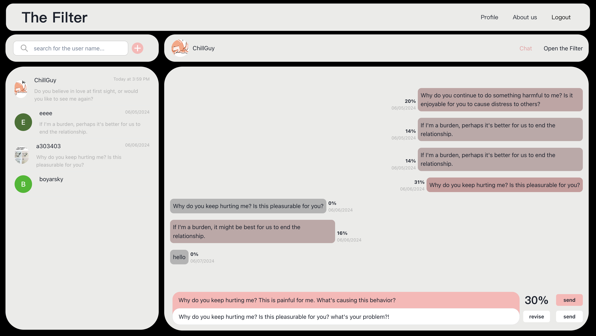

# Come_Bake Web

Open [The Filter](http://luffy.ee.ncku.edu.tw:3000) to try the new way to chat!

### Welcome to Our Chat App!

Once you've signed up, connecting with friends is easy—simply search for their names and start chatting.

Our chatroom offers a unique revise function that allows you to adjust your messages. This feature ensures you can modify the content without losing the emotional value. So, you can express your feelings freely without worrying about unintentionally hurting someone.

### Analyze Your Relationships with Our Insightful Tools

Our analysis page offers valuable insights into your relationships through various data points.

1. Word Cloud: This feature highlights common interests and topics between you and your friends.
2. Message Revision Data: See how frequently you revise your messages, providing insights into your communication style.
3. Customizable Reports: Use the calculate function to generate analysis reports for specific time periods.

## Available Scripts

In the project directory, you can run:

### `yarn start`

Runs the app in the development mode.\
Open [http://localhost:3000](http://localhost:3000) to view it in your browser.

The page will reload when you make changes.\
You may also see any lint errors in the console.

### `yarn run build`

Builds the app for production to the `build` folder.\
It correctly bundles React in production mode and optimizes the build for the best performance.

The build is minified and the filenames include the hashes.\
Your app is ready to be deployed!

### `yarn deploy`

Will builds the app for production and deploy on the gitpage.
Needs to rewrite the homepage url and download gh-pages.

## Socket

Our website includes a notification function that alerts you when you receive a new message. To enable this feature, visit our [repository](https://github.com/hsiangling0/socket_chat) for detailed instructions on setting up the socket.
